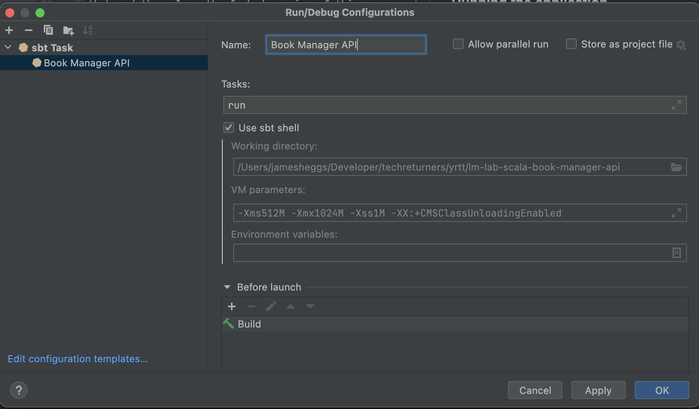
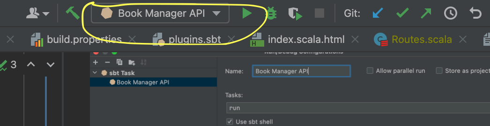

# 📖 Minimalist Book Manager API

## Introduction

This is the starter repository for API development in Scala. 

It provides a start to creating a Minimalist Book Manager API using a Test-Driven Development approach.

This Scala application makes use of a framework called the [Play Framework](https://www.playframework.com/) in order to create a [ReST API](https://www.smashingmagazine.com/2018/01/understanding-using-rest-api/) that accepts and responds with JSON.

The API provides the following end points:

* GET `/books` to retrieve all books
* GET `/books/:bookId` to retrieve information about a single book
* POST `/books` to save a new book (expects JSON to be posted in the request body)
* PUT `/books/:bookId` to update a book (expects JSON to be posted in the request body)

If you're a bit like me and want to see a starting from scratch tutorial on how an API like this can be made, here is a good tutorial through many of the approaches you'll find on the repository - just note we don't create a secure API in this example and as thus don't utilise any of the Auth0 services.

https://auth0.com/blog/build-and-secure-a-scala-play-framework-api/

## Pre-Requisites

**NOTE:**

At the time of writing, the Play framework was exploring support for Java 17 so if you are running Java 17 it might still be worth having a try.
https://github.com/playframework/playframework/pull/11206

- Java SE Development Kit 11 
- Scala version 2 (Tested with v2.13.8)
- sbt (Tested with v1.6.2)

## Technologies & Dependencies

- Scala [Play Framework](https://www.playframework.com/)
- [Google Guice](https://github.com/google/guice) for dependency injection 

## How to Get Started

Fork this repository to your GitHub account and then clone your forked version to your computer

### Running the application from IntelliJ

To run the application using IntelliJ:

Click **Run** from the top menu

Then click **Edit Configurations...** and you should see a new **Run/Debug Configurations** dialog

Click the + button to add a new configuration and then choose **sbt Task**

In the name let's call it **Book Manager API**

Then in the **Tasks** textbox, enter **run**

Your setup should look similar to the image shown below:

With the run configuration defined you can now run (or debug) the application from run menu in the top right corner of IntelliJ by clicking the green play button.

Once the application is running you can explore the API such as:

http://localhost:9000/books 

### Running the application from command line

Alternatively if you prefer to run the application by the command line, you can navigate to the root of the project and run:

`sbt run`

### Stopping the application

To stop the application click the small red **Stop button** towards the bottom left hand corner of IntelliJ or if you are running from command line you can do **Ctrl+C**

### Running the unit tests

You can run the unit tests in IntelliJ by **right clicking** the **test** directory and choosing **Run > All tests**

Alternatively if you prefer to run the tests by the command line, you can navigate to the root of the project and run:

`sbt test`

## Tasks

Here are some tasks for you to work on:

### 📘 Task 1: Discussion Task

Explore the code and make notes on the following features and how it is being implemented in the code. 

We'd like you to note down what classes and methods are used and how the objects interact.

The features are:

- Get all books
- Get a book by ID
- Add a book
- Update a book

As well as the scala code it's worth having a look at the [routes](conf/routes) file as well. Can you see where the routes for the books are configured....

### 📘 Task 2: Implement the following User Story with tests.

`User Story: As a user, I want to use the Book Manager API to delete a book using its ID`

### 📘 Extension Task: Error handling

Oh no! 😭 We've only covered the happy paths in the solution, can you figure out a way
to add in exception handling to the project?

- Clue 1: What if someone wants to add a book with an ID for a book that already exists? How do we handle this gracefully?

- Clue 2: What if someone wants to find a book by an ID that doesn't yet exist?
  How can we improve the API by handling errors gracefully and show a helpful message to the client? What should the server status code be? 
  